.. |date| date:: %m/%d/%y
.. sectnum::

FastPath GUI User Manual
````````````````````````````

:Date: |date|

--------------

.. contents:: Table of Contents

--------------


Introduction
---------------

The FastPath GUI provides a simple and intuitive way of using the Chip Specification Language features on a design project. It is used to create
the infrastructure for RTL, test-benches and SystemC. It allows the user to create the design hierarchy, connectivity library and connection table.

The FastPath GUI has a graphical interface written in QT but also supports command line parameters. It is started using the executable **FastPath**.
The following sections cover the graphical interface.

The Project
================

The project inside the GUI is the representation of the actual design project. It has three main regions as can be seen in the screenshot:

- Design Hierarchy (highlighted with the green arrow) - contains the hierarchy of units
- Connectivity Library (highlighted with the blue arrow) - contains the items used for connecting modules
- Connection Table (highlighted with the red arrow) - contains the connections between the modules

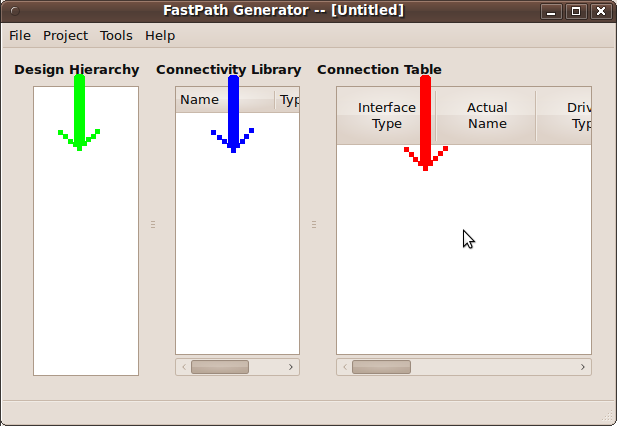

Units
+++++++++

The unit is a design element similar to a Verilog *module* and it can be found in the **Design Hierarchy**.
In a project there can only be a single unit as root for the entire **Design Hierarchy**.

Interfaces
+++++++++++++++

The interface is a logical group of `ports`_ and other `interface instances`_ . It is attached to a unit.
A unit can have one or more interfaces attached.

Interfaces are found in the **Connectivity Library**.

Ports
~~~~~~~~~~~

The *port* is the equivalent of a Verilog *port*. One or more ports can form an interface (see `Interfaces`_ ).

.. image:: gui_img/port_property_editor.png

As in other hardware description languages like verilog, a port has a number of attributes including the following:

- name - as presented in the screenshot above, it can be a group of letters and/or numbers without white spaces (use \"_\" instead).
- direction - can be one of:

  - input
  - output
  - inout

- width or bit range - these two attributes are synchronized - changing one will result in the modification of the other.
- type - the **RTL Type** can be one of the following:

  - wire
  - wand
  - wor
  - tri
  - triand
  - trior
  - tri0
  - tri1
  - supply0
  - supply1
  - reg
  - integer
  - time
  - NONE

Usually in designs, a port has a special logical meaning, like a clock or reset signal. 
The user can select a **Logic Type** for each port that matches the meaning of the port.
The GUI behaves differently for each port with special logical meaning.

The **Logic Type** can be one of the following:

- enable
- stall
- mux select
- decoded minterm
- decoded maxterm
- clock signal
- reset signal
- NONE

Interface Instances
~~~~~~~~~~~~~~~~~~~~

Interface instances are used to create instances inside other instances. The restriction is that the interface hierarchy tree can not have a cyclic branch. 
This means that starting from each interface, we can not reach the same interface by descending in any of the interface hierarchy trees it has.

Signal Groups
+++++++++++++++

A signal group is a collection of one or more signals. The signal has the attributes of a port with the exception of *direction*.

Connections and the Connection Table
+++++++++++++++++++++++++++++++++++++++

A unit can communicate with another unit through interfaces. A connection is required to connect the interfaces and assign them to the corresponding units,
thus an interface is instantiated inside an unit through the creation of a connection. Currently there is no other way of instantiating an interface in an
unit.

All connections are added in the **Connection Table**. This table provides information regarding the interface type being connected, the name of the
connection, the driver type (single or multi), the driver unit instance (where this driver resides), the interface instance name where the driver is 
connected (named driver connection instance), the type of the receiver (single or multi), the name of the receiving unit instance (receiver unit instance),
the name of the interface instance receiving the connection (receiver connection instance).

Below we have an example of a connection named *connection1* between an unit (my_unit2) and its parent (my_main_unit) through an interface of type 
*my_int2*. The driver is a single one, just like the receiver, named *m1* and, respectively, *r2*.

.. image:: gui_img/connection_table_one_connection.png

Preferences
+++++++++++++++

All projects have the same customization options which include:

- `netlisting mode`_
- `floor planning`_
- `target device`_
- `generate include statements`_

These are accessible through the menu: *Project* -> *Preferences*

Netlisting Mode
~~~~~~~~~~~~~~~~~~

In the netlisting mode the GUI should generate only instances with their attributes and their children. Everything else like simulation code should be stripped.

Floor Planning
~~~~~~~~~~~~~~~~~

If this option is selected then only the first and second level from the design hierarchy are used.

Target Device
~~~~~~~~~~~~~~~~~


Generate Include Statements
~~~~~~~~~~~~~~~~~~~~~~~~~~~~~~~

If selected, this option instructs the GUI to automatically generate *include* statements in the *.csl* file. There is a global *csl_include* statement and one
in the root unit. The csl file included is named after the project name and ends with the suffix *_global_includes*, for example: ::

  csl_include "/absolute/path/to/project/my_project_name_global_includes.csl"

This file can be altered in order to use custom code. 

**Note:** Use this method for features present in the CSL Compiler, however unsupported by the GUI.

Using the GUI
------------------

**Note:** The GUI tries to be as simple as possible, thus many actions can be performed by right-clicking on items.

The menu layout is comprised of four categories:

- File - allows the user to create, open, save projects or exit the application.
- Project - contains project related menus, like *Preferences* or CSL code generation.
- Tools - allows the user to select and run various tools, like the CSL Compiler.
- Help - provides access to the help options and *About* information.

Create a project
=====================

To create a new project select: *File* -> *New*

.. image:: gui_img/new_project.png

This action prompts if there are unsaved items before creating a new empty project.
Make sure to save your previous work when prompted since it will be permanently lost.

When an empty project is created, the unit hierarchy, connectivity library and the connection table are cleared, preferences are reloaded and the name
of the project is undefined (the name of the project appears in the window title).

An empty project is not useful, let's add some units and interfaces, also let's create some connections between units using the created interfaces.

Add an unit
+++++++++++++

In order to add an unit right-click anywhere inside the **Design Hierarchy** area, even on other units in order to create a child unit,
then select *Add New Unit*. 

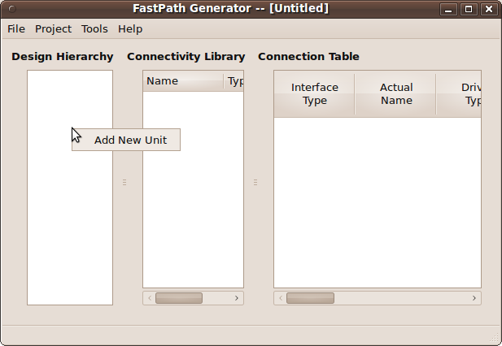

This adds a root unit if there is no other unit present before.
Please remember that there can be only one root unit.

A new window pops up, the *Unit Property Editor* where the unit name, abbreviation and description can be entered:

.. image:: gui_img/unit_property_editor.png

**Note:** The *Hierarchy Level* is normally grayed and it displays a number representing the level in the unit hierarchy where the new unit is placed. 1 stands for
the root unit.

Enter an unit name (should be unique), the optional abbreviation (in the future it may be used as a short name) and the optional description. When done
press OK. The new unit will appear in the **Design Hierarchy** area.

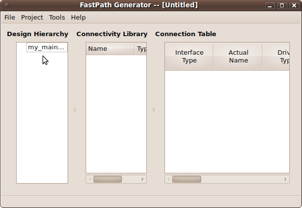

The entire information in the design hierarchy is not visible. To increase the visibility of that region let us hide the connectivity library. Click and hold on the 
separator between them as shown in the picture below:

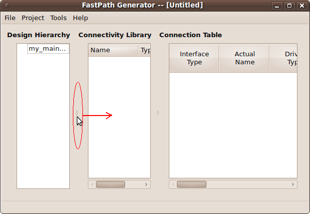

Drag the mouse to the right while keeping the mouse button pressed (as indicated above).

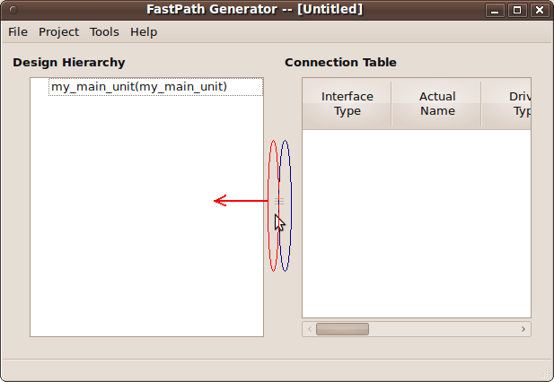

To unhide the connectivity library click and hold on the separator (highlighted with red) then drag the mouse to the left while keeping the button pressed 
(as indicated above). Note that next to the separator
between the design hierarchy and the connectivity library there is the separator between the connectivity library and the connection table (highlighted with blue).

.. image:: gui_img/hide_conn_lib_p3.png

Draging the later will make the design hierarchy area to shrink and the connectivity library to get bigger:

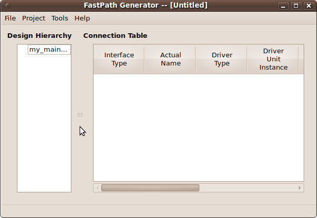

Do not panick if you dragged the wrong separator. Just drag the right one (highlighted with blue) to the right as shown below:

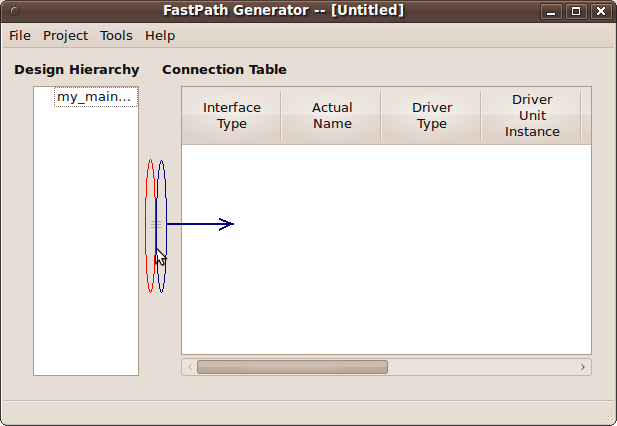

Let's add an unit instance to the root unit. Right click in the empty white space or on the root unit and select *Add Unit Instance*:

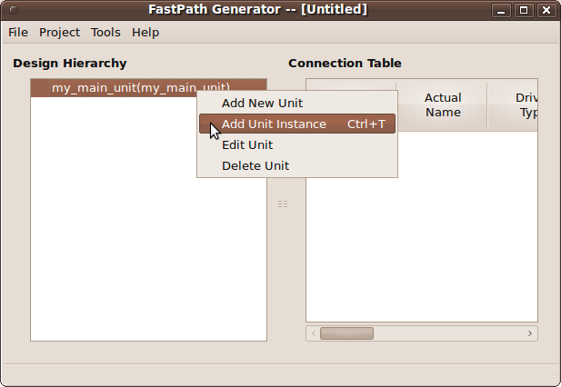

This window should open:

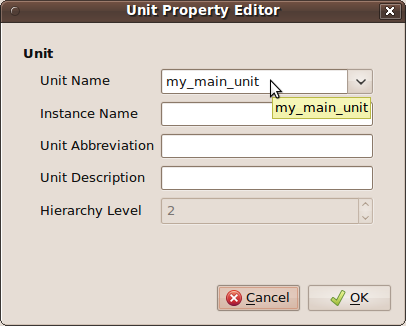

The field *Unit name* contains the type name of the unit. Currently it is *my_main_unit*. Let us change it to something else like *dummy_master*. This will create a new
unit type called *dummy_master* after we press the OK button. Let's name the *instance name* as *dummy_master_inst*, the abbreviation for this instance as *dminst* and a 
description as *master*. Then press OK.

.. image:: gui_img/dummy_master_unit_property.png

The gui should now look like this (notice that the new unit instance is created beneath the root unit and as its child):

.. image:: gui_img/after_dummy_master_unit.png

Let's add some interfaces. For this unhide the connectivity library as described previously.

Add an interface
++++++++++++++++++

To add an interface (see chapter `Interfaces`_ for a description of the interface) right-click in the **Connectivity Library** area and select *Add* -> *New Interface*.

.. image:: gui_img/add_new_interface_click_menu.png

In the new window enter the name of the interface, for example *my_interface*, and then press **OK**:

.. image:: gui_img/interface_property_editor.png

The new interface will be added in the **Connectivity Library**:

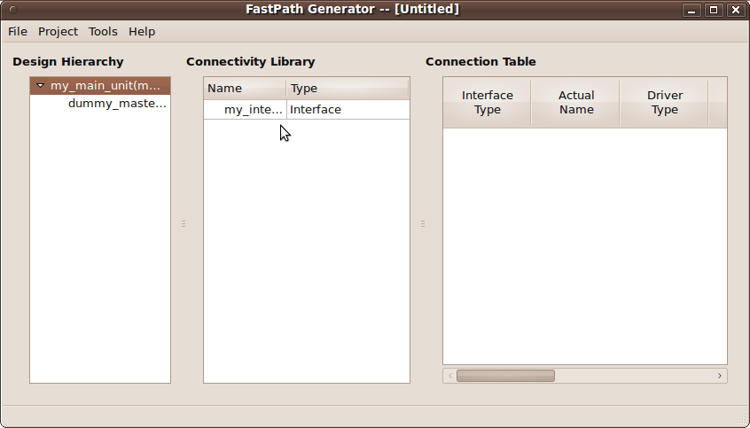

Add a new interface by right-clicking in the connectivity library area (in the free space or even on other interfaces, ports, signals etc.). Select *Add* and then
*New Interface*:

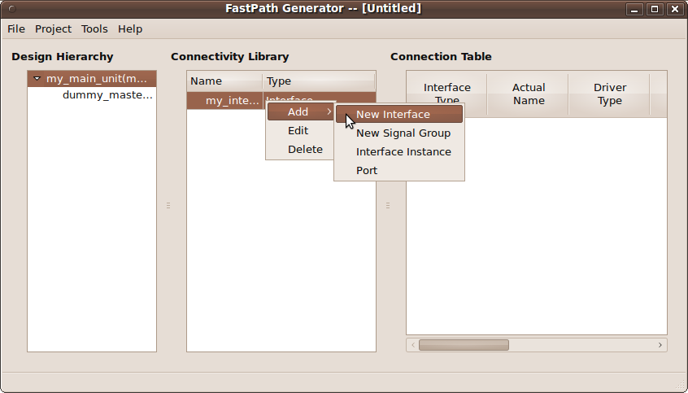

In the window that opens, name the new interface as *bus_interface* and then press the OK button:

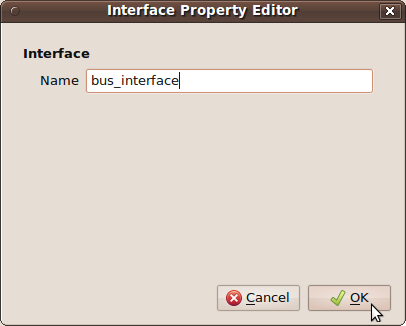

This will add a new interface type named *bus_interface*:

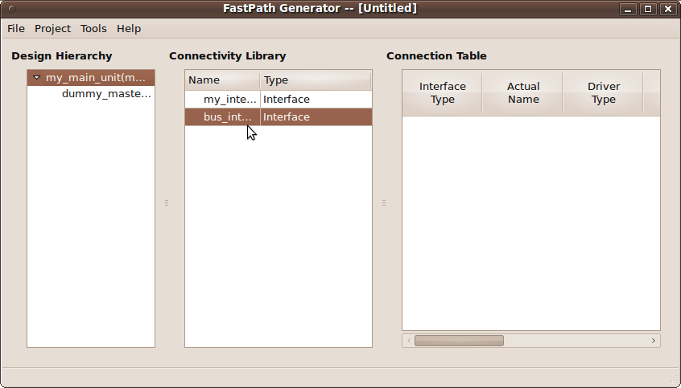

Let's add an interface instance to *my_interface*.
In order to add an interface instance to an interface, right click on the interface where you want to put the instance, in this case right-click on *my_interface*,
select *Add* -> *Interface Instance*:

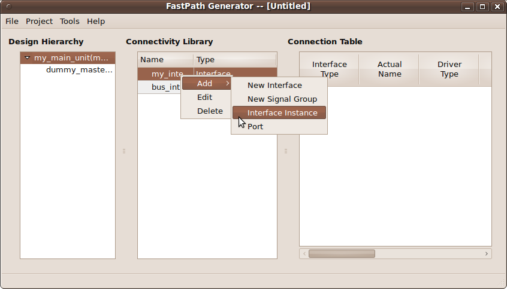

In the window that opens, select the interface instance type from the drop-down list next to **Name**. Note that you can not select as type the same
interface like the one where you want to add the instance, in this case *my_interface*. You can not create recursive interfaces. Select *bus_interface*. 
Next, enter the name of the interface instance, for example *bus_inst*, and then press OK.

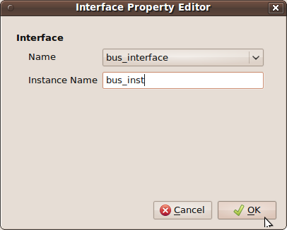

A new child will be added in the **Connectivity Library** under the interface *my_interface*. The name of the instance is in parenthesis:

.. image:: gui_img/my_interface_bus_inst_con_lib.png

Add a port to *my_interface*. Right-click on it, select *Add* -> *Port* :

.. image:: gui_img/my_interface_add_port_menu.png

A new window will open which allows you to add a port (see ports_ for a description). Name the port *my_int_clock* and all the other fields as below:

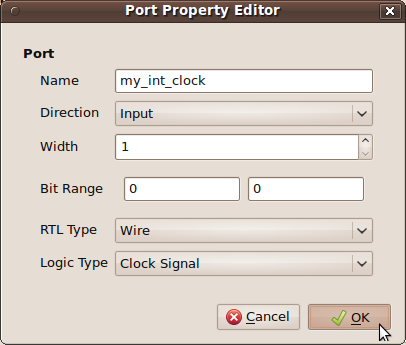

Pressing OK will add a port to the interface *my_interface*.

.. image:: gui_img/my_interface_my_int_clock_con_lib.png

**Note**: Double-click on any column separator to automatically adjust column width to fit contents.

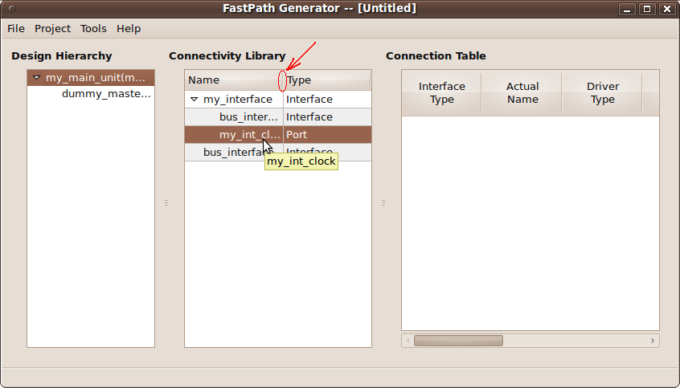

.. image:: gui_img/my_interface_my_int_clock_con_lib3.png

Add a new port to the *bus_interface*:

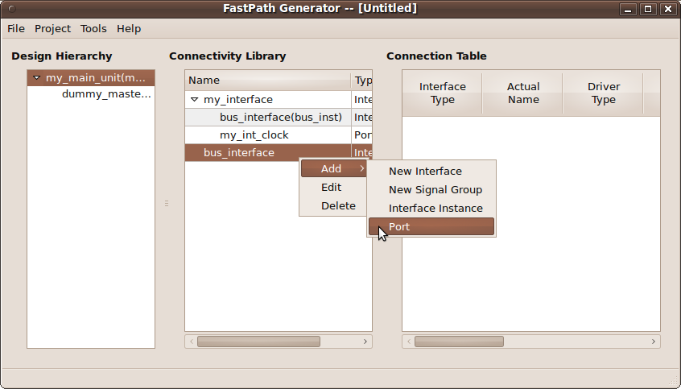

In the window that opens, named *Port Property Editor*, let's enter the information as seen:

.. image:: gui_img/bus_interface_wire_port_editor.png

Pressing the OK button will add a new input port with the width 32 to *bus_interface*. This change will reflect on the *bus_inst* interface located in *my_interface*.

.. image:: gui_img/bus_interface_bus_port_in_inst.png

Let's add another interface named *bus_out_int* with one output port named *bus_wire_out* with the properties seen below:

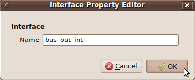

.. image:: gui_img/bus_out_wire_editor.png

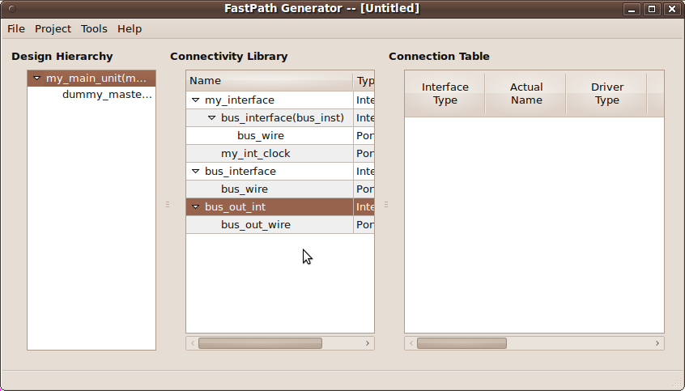

After adding some units and interfaces, let's create some connections.

Make a connection
++++++++++++++++++++

To make a connection (see `Connections and the Connection Table`_ for more information) right-click in the **Connection Table** area (either on the free space or 
on the name of another connection) and select *Add Connection*.

.. image:: gui_img/add_connection_menu.png

In the new window named *Interface Connection*, select the *Connection Type* as *Interface* from the drop-down menu, enter the *Actual Name* as *mmu2dminst* and
select the *Library Interface* as *my_interface*. Then press OK.

.. image:: gui_img/interface_connection.png

The above action will create an empty connection in the connection table, with no driver or receiver. For more information on how to edit a connection
in order to add a driver and receiver, see how to `edit connections`_ .

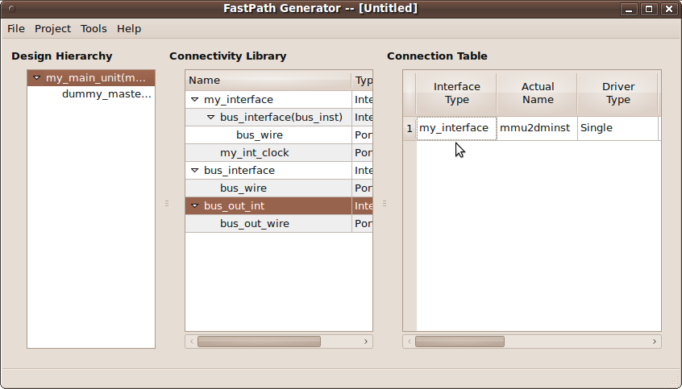

After creating all this, we should save the project.

Save and Open a Project
==========================

The project information is stored in a file named after the project and it has the extension .csl.xml . The generated csl code is located in
a file named after the project with only the .csl extension.

For example, if the project is named *my_project* then the following files are located in the project directory:

- my_project.csl.xml - contains project information in xml format
- my_project.csl - contains generated csl code
- my_project_global_includes.csl - this file is optional, please see `Generate Include Statements`_ for more information

To save a project, select *File* from the menu and then *Save*, or press CTRL+S. In case that the project is unnamed (is a new one) then a name
can be chosen in the window that opens or by selecting *Save-as* in the *File* menu instead of *Save*:

.. image:: gui_img/file_save_menu.png

Name the project as *my_project*:

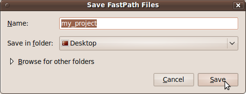

Pressing the *Save* button will save the .csl.xml file and generate the csl code. This will change the title of the application's main window:

.. image:: gui_img/project_title_window_after_save.png

To generate csl code at any time, select *Project* -> *Generate CSL* menu.

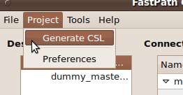

To open a project select *File* and then *Open*, or CTRL+O.

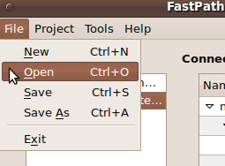

Select the project you want to open and then press *Open*.

.. image:: gui_img/open_project.png

Opening the current loaded project will prompt to reload the project.

Edit a project
===================

Edit Units
+++++++++++++

To edit an unit right click on the wanted unit and select *Edit Unit*. Only the unmodifiable attributes should be grayed out like in the following image:

.. image:: gui_img/dummy_master_unit_property.png

The name of the unit can be an already created unit type selected from the drop-down list or it can be manually entered.

The instance name must be unique.

The modifications are saved when the *OK* button is pressed.

To delete an unit, right click on it and then select *Delete*. Confirm the deletion by pressing the OK button.

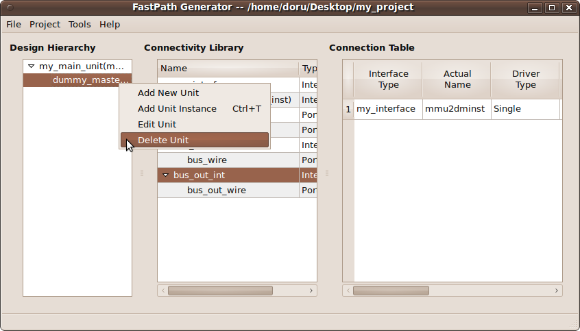

Edit Interfaces
+++++++++++++++++

Right-clicking on an interface and then selecting *Edit* will open the Interface Property Editor for that interface. The name of that interface can be 
edited unless it is already in use in a connection.

.. image:: gui_img/interface_property_editor.png

To delete an interface, right click on it and then select *Delete*. Confirm the deletion by pressing the OK button.

.. image:: gui_img/interface_delete_menu.png

Edit Signal Groups
++++++++++++++++++++

Right-clicking on a signal group and then selecting *Edit* will open the Signal Group Property Editor for that signal group.

To delete a signal group, right click on it and then select *Delete*. Confirm the deletion by pressing the OK button.

Edit Connections
++++++++++++++++++

To edit a connection properties like name and library interface, right click on the interface type name of the connection (column *Interface Type* in the
connection table) and then select *Edit Connection*.

.. image:: gui_img/edit_connection_menu.png

To add a driver for a connection right-click either in the column *Driver Unit Instance* or *Driver Connection Instance* of the connection table
and then select *Add Driver*:

.. image:: gui_img/add_driver.png

Let's edit the connection from the previous chapter when we learned how to `make a connection`_. Add a driver to the connection named *mmu2dminst*.
A new dialog opens in which can be selected the unit interface and the corresponding interface instance name:

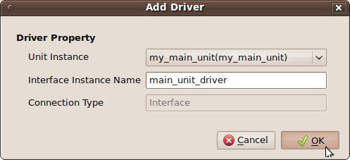

The above will add a driver named *main_unit_driver* in *my_main_unit* instance. The driver is of type instance named *my_instance* as seen in the connection.

.. image:: gui_img/my_main_unit_driver_con_table.png

Let's add a receiver in the unit *dummy_master_inst* instance. This will complete the connection between the *my_main_unit* instance and *dummy_master_inst* instance.
Right-click on either *Receiver Unit Instance* or *Receiver Connection Instance* column belonging to the *mmu2dminst* connection.

.. image:: gui_img/add_receiver_menu.png

Select the unit instance that houses the receiver as the *dummy_master_inst* from *my_main_unit*. Name the receiver *dum_receiver_inst* as seen below:

.. image:: gui_img/dum_receiver_inst_dialog.png

The connection table should look like this:

.. image:: gui_img/dum_receiver_inst_con_table.png

A multi driver connection is created by adding a new driver to a connection that already has one or more drivers. A new line below the selected connection will contain
the same information but with the new driver. It can be modified if necessary.

A multi receiver connection is created in the same way as a driver. Please make sure to connect the proper driver with the proper receiver in the intended unit.

To delete a connection, driver or receiver, right click on it and then select *Delete*. Confirm the deletion by pressing the OK button.

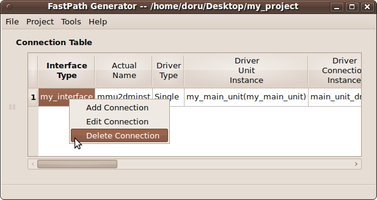

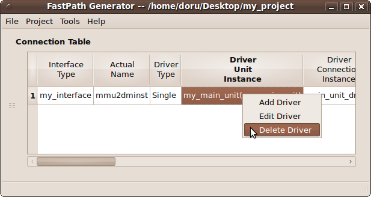

.. image:: gui_img/delete_receiver_menu.png

Let's create a bus split using the driver from *my_main_unit* to connect with another unit, like *dum_slave_inst*. Create the unit *dum_slave_inst* in *my_main_unit*
like described in chapter `Add an unit`_ :

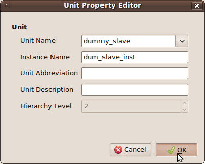

Add a driver to connection *mmu2dminst*. Select the *my_main_unit* instance as unit instance and then press OK:

.. image:: gui_img/add_dum_slave_driver.png

The connection table contains the new driver on the next line:

.. image:: gui_img/dum_slave_driver_con_table.png

Next, add a receiver to the connection by right-clicking on either *Receiver Unit Instance* or *Receiver Connection Instance* column belonging to the *mmu2dminst*
connection on line 2:

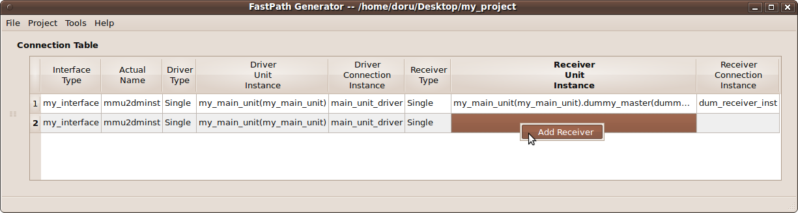

Select as unit instance the *dum_slave_inst* instance:

.. image:: gui_img/dum_slave_receiver_editor.png

The connection table now has a connection with a single driver and multiple receivers, meaning that it is a bus split connection type.

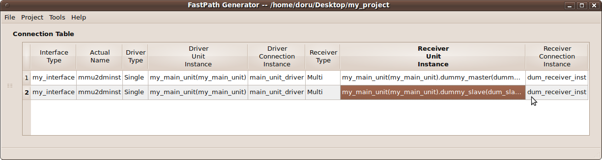

Tools Menu
=============

Compiling CSL
+++++++++++++++++

Compiling the csl code for the project can be done from the GUI:

- make sure that the project uses the cslc compiler by selecting the cslc binary in the *Tools* -> *Options* menu:

.. image:: gui_img/tools_options.png

- generate the csl code (it may already be generated when the project is saved): *Project* -> *Generate CSL*


- start the compilation process by selecting *Tools* -> *Compile CSL* or by pressing CTRL+E. A console will open containing the results of the compilation.

Other
---------

General tips
==============

GUI
++++++++

- Usually, double clicking on the separator between two columns will automatically resize the left column to fit it's contents.


- To make more space, the three areas, **Design Hierarchy**, **Connectivity Library** and **Connection table** can be hidden by dragging the separator
  between them (indicated by the mouse arrow in the pictures below) to left or right:


.. image:: gui_img/hide_conn_lib_p4.png
.. image:: gui_img/zone_separators.png
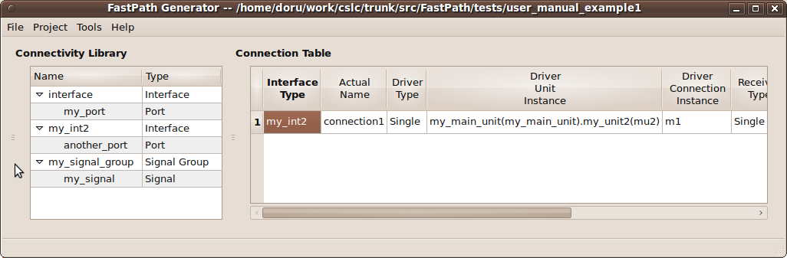

- Using keyboard shortcuts whenever possible speeds up the design process
- Various actions can be implemented with an external editor of choice that can read the .csl.xml project file if the editor is too slow.
- Altering the current loaded project file outside the gui will prompt the user to reload the project.

Reporting Bugs
===================

Please report any bugs to TO BE COMPLETED

Final Words
--------------

